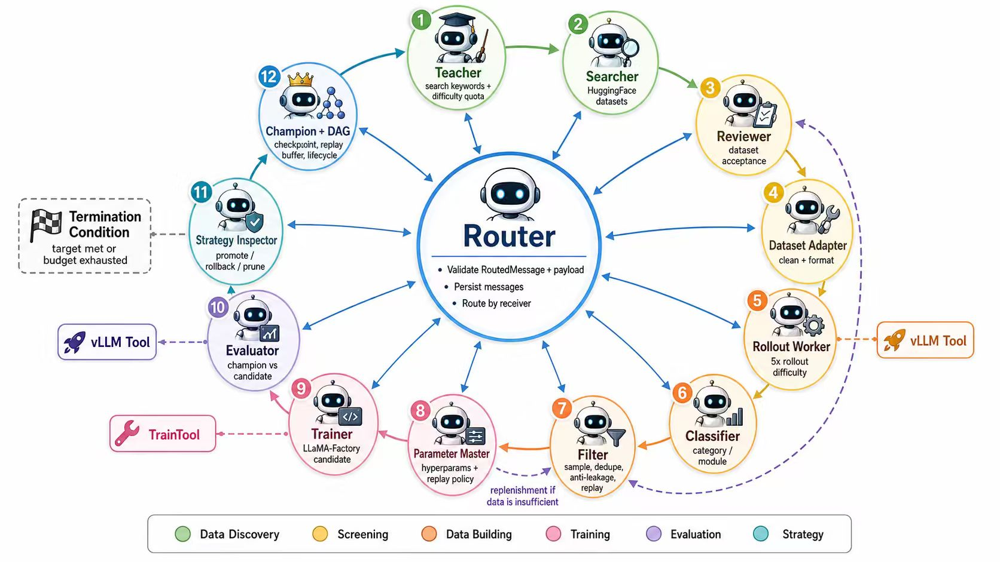
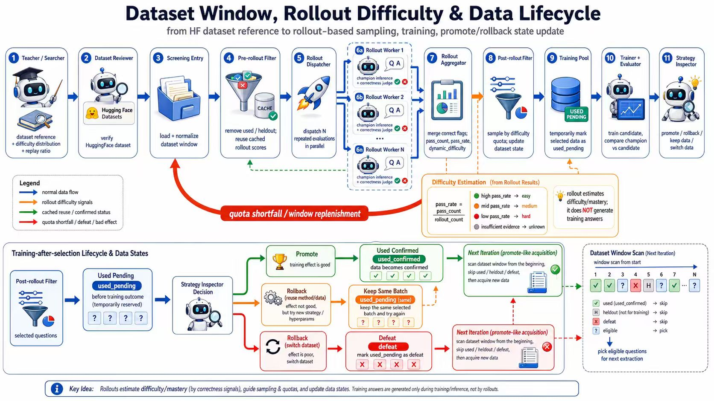
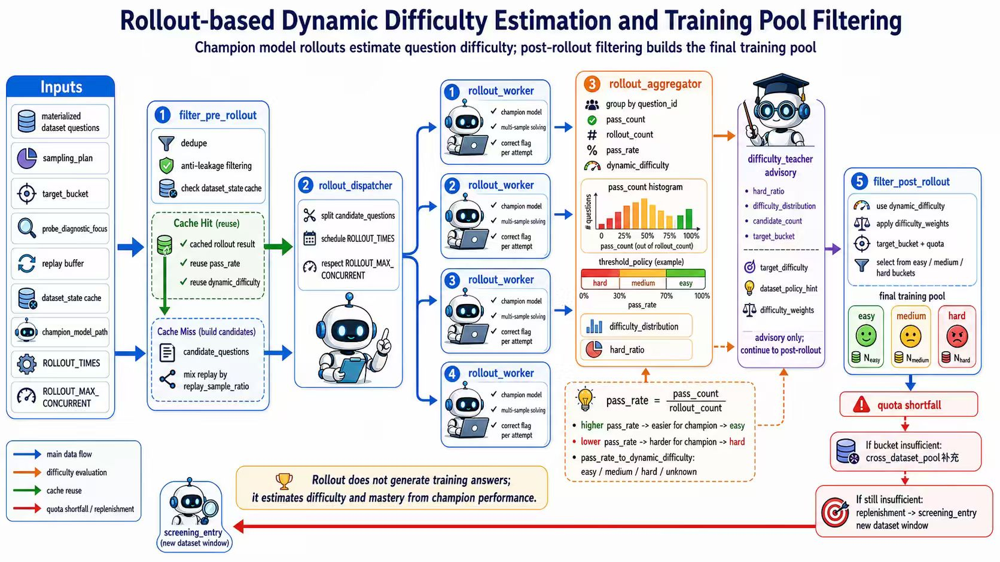

# EvoChampion

LangGraph 驱动的**模型适配与课程搜索闭环**：围绕一个目标（例如“提高数学能力”），自动检索与审查训练数据、用当前 champion 模型估计题目难度、构建课程化的训练集、调用 LLaMA-Factory 训练 candidate，再用冻结 probe 与外部基准评估，决定晋升、回滚或继续搜索。

> ⚠️ **如实说明边界**：EvoChampion 是**有外部评估约束的模型适配与课程搜索闭环**，不是能自动改写 agent 代码、图拓扑或算法实现的开放式自修改系统。当前端到端实现主要在**数学推理**域验证；dataset reviewer、默认推理提示词、答案校验与主要 probe 都偏向数学任务。完整闭环依赖 GPU 与多个外部组件，本发布包只验证了无模型服务的 `quick_demo.py` 与两个单元测试，**不要假设重量级流程在本仓库内已经跑通**。



## 这是什么 / 不是什么

**会变化**：候选数据集、数据窗口、难度与模块配比、replay 比例、训练超参、部分 agent prompt、candidate 权重与最终 champion。

**会积累**：DAG edge reward、replay buffer、mastered memory、heldout registry、dataset state、评估 trace 与每轮 artifact。

**保持固定**：LangGraph 节点代码、图拓扑、工具实现、消息 schema 与 evaluator 程序本身**不会被系统自动改写**。

**外部锚点**：frozen probe、holdout、MathBench/OpenCompass、符号答案校验与人工设定的 gate，负责阻止“只优化自己生成的分数”。

因此它比一次性 SFT 脚本更进一步，但**还不是** ADAS / Darwin Gödel Machine / AlphaEvolve 意义上的开放式自修改系统。

## 端到端流程

一轮典型闭环：

```text
数据发现 → review → rollout 难度估计 → 筛选 → 训练 → 评估 → 晋升/回滚
```

展开为 LangGraph 节点：

```text
bootstrap
  -> prompt_designer -> router
  -> teacher -> parameter_master          # 策略层：搜什么、怎么配难度、怎么训练
  -> searcher -> hf_search_tool           # 数据发现
  -> dataset_reviewer -> screening_entry  # 审查与物化
  -> filter_pre_rollout                   # 预 rollout 采样
  -> rollout_dispatcher -> rollout_worker(s) -> rollout_aggregator   # 难度估计
  -> filter_post_rollout                  # 筛选、补窗、配额、replay 混合
  -> classifier -> data_builder           # 分类与训练数据包
  -> trainer -> evaluator                 # LLaMA-Factory 训练与评估
  -> strategy_inspector                   # 晋升 / 回滚 / 剪枝 / 停止
  -> router -> 下一轮或结束
```

核心思想：题目难度 `dynamic_difficulty` 是**相对当前 champion 的动态难度**，由两阶段 cascade rollout 判定：

```text
easy   = 当前 champion 不开思考就能答对
medium = 当前 champion 不开思考答错，但开思考能答对
hard   = 当前 champion 开思考也答不对
```



## 主要能力

- 按目标搜索 Hugging Face 数据集，网络失败时使用预定义 fallback 数据源。
- 异步 review、schema inspection、窗口化加载与题目标准化。
- cascade rollout 动态难度标注，保留 `easy/medium/hard/unknown` 与 pass-rate 证据。
- `teacher` / `parameter_master` / `data_builder` 生成搜索、难度配比、模块配比、replay 比例与训练超参。
- `filter` 执行采样计划：去重、mastered 剔除、rollout 缓存复用、跨数据集补窗、配额补齐与 replay 混合。
- LLaMA-Factory full finetune / LoRA 训练，candidate 写入 artifacts。
- transformers 或 vLLM/Ray actor 推理评估，支持 `math-verify`、SymPy fallback、可选 LLM judge 与 MathBench/OpenCompass probe。
- DAG / MCTS 参数搜索、replay buffer、mastered memory、heldout registry 与 session artifacts 保留可追踪历史。

## 技术栈

| 层次 | 选型 |
| --- | --- |
| 图编排 | LangGraph（`StateGraph` + `Send` 并行 fan-out） |
| 消息协议 | Pydantic 模型 + router 校验 + artifact ref |
| 推理 | transformers / vLLM / Ray named actor |
| 训练 | LLaMA-Factory（`llamafactory-cli`） |
| 数据 | `datasets` / Hugging Face Hub / HFD cache |
| 分类 | GLiNER |
| 判定 | `math-verify` + SymPy fallback，可选 LLM judge |
| 外部 probe | MathBench / OpenCompass |
| 语言 | Python ≥ 3.13 |

## 架构图

全部六张图位于 `docs/architecture/`：

| 图 | 内容 |
| --- | --- |
| [system-overview.jpg](docs/architecture/system-overview.jpg) | 系统全景：数据发现 → 筛选 → 训练 → 评估 → 策略 |
| [rollout-difficulty-filtering.jpg](docs/architecture/rollout-difficulty-filtering.jpg) | rollout 动态难度估计与训练池筛选 |
| [historical-dag-mcts.jpg](docs/architecture/historical-dag-mcts.jpg) | 历史 DAG / MCTS 证据检索与融合 |
| [continuous-hyperparameter-search.jpg](docs/architecture/continuous-hyperparameter-search.jpg) | 连续参数 surrogate-UCB 搜索与输出 |
| [continuous-hyperparameter-search-overview.jpg](docs/architecture/continuous-hyperparameter-search-overview.jpg) | 连续参数搜索总览 |
| [data-lifecycle.jpg](docs/architecture/data-lifecycle.jpg) | 数据窗口、难度与数据状态生命周期 |



## 快速开始

### 0. 环境要求

- Python ≥ 3.13（见 `.python-version`）。
- 推荐 `uv`（`uv sync`），或 `python -m venv` + `pip install -r requirements.txt`。
- **无模型服务的演示不需要 GPU**；完整闭环需要 GPU + Hugging Face + vLLM/Ray + LLaMA-Factory（详见下文“重量级前提”）。

### 1. 无模型服务快速演示

`quick_demo.py` 只演示消息协议流转，不加载模型、不访问网络：

```bash
python quick_demo.py
```

### 2. 准备环境变量

```bash
cp .env.example .env
```

至少确认：

```bash
BASE_MODEL_NAME=Qwen/Qwen3-0.6B
CHAMPION_MODEL_PATH=Qwen/Qwen3-0.6B
AGENT_BASE_MODEL_NAME=Qwen/Qwen3-0.6B
CANDIDATE_MODEL_DIR=artifacts/candidates
```

### 3. 安装依赖

```bash
python -m venv .venv
source .venv/bin/activate
pip install -r requirements.txt
```

如果使用 `uv`，它会按 `pyproject.toml`/`uv.lock` 创建轻量控制面环境，适合消息协议演示和基础测试：

```bash
uv sync
```

要运行完整模型适配闭环，还需安装 `requirements.txt` 中的训练、推理和可选服务依赖；这部分依赖 GPU、模型权重以及外部工具，不能由轻量锁文件自动替代。

### 4. 安装 LLaMA-Factory

```bash
git clone https://github.com/hiyouga/LLaMA-Factory.git
cd LLaMA-Factory
pip install -e .
```

训练启动逻辑通过子进程调用 `llamafactory-cli`，因此它必须能在当前环境的 `PATH` 上直接执行。

### 5. 最小完整运行

```bash
python main.py "提高数学能力" \
  --benchmark gsm8k \
  --benchmark-subset main \
  --benchmark-question-key question \
  --benchmark-answer-key answer \
  --benchmark-format gsm8k \
  --benchmark-eval-split test \
  --max-rounds 3
```

> 该命令会走完整图，只是规模由配置控制。**真实运行前请先读 [docs/08-runtime-configuration.md](docs/08-runtime-configuration.md)**，并确认 GPU、模型、cache 与 LLaMA-Factory 都已就绪。

## 重量级前提

完整闭环是重型实验系统，不是玩具 demo：

- **GPU**：训练与评估需要 GPU；纯 CPU 只能做很小规模流程验证。
- **Hugging Face**：搜索与下载数据集需要网络；国内环境建议设置 `HF_ENDPOINT=https://hf-mirror.com` 并预下载模型/数据集。
- **vLLM / Ray**：`USE_VLLM=1` 时经 Ray actor 承载 vLLM 引擎，涉及显存、actor 生命周期与模型切换。
- **LLaMA-Factory**：训练必须 `llamafactory-cli` 可用。
- **GLiNER**：分类默认加载 GLiNER 模型（`USE_GLINER=1`）。
- **OpenCompass**：`FROZEN_PROBE_EVAL_METHOD=mathbench_opencompass` 时需要单独安装并配置 OpenCompass。
- **可选 DeepSeek**：`DATA_CLEANER_PROVIDER=deepseek` 时为复杂数据集生成确定性 cleaner。

这些外部依赖意味着完整流程**不会在本发布包里直接“跑通”**——请在 GPU 实验环境中按文档逐步配置。

## 运行脚本

| 脚本 | 用途 |
| --- | --- |
| `run_demo.sh` | 轻量演示：生成 `.env`、安装依赖、打印用法。 |
| `run.sh` | 服务器正式实验模板：HF cache、fallback datasets、vLLM/Ray、MathBench、候选模型目录与训练/推理规模设置。 |
| `run_job.sh` | Slurm 包装脚本：加载 `.env`、设置代理、`--dry-run` / `py_compile` 预检，再执行 `run.sh`。 |

`run.sh` 与 `run_job.sh` 中包含 **`<USER>` / `<GROUP>` / `<PROXY_IP>` 等明显占位符**，发布时已替换真实服务器路径；使用前请替换为你自己的路径与集群配置。`run_job.sh` 提交前建议先：

```bash
bash run_job.sh --dry-run
```

## 配置

主要配置在 `config/settings.py`，可通过 `.env` 或 CLI 覆盖。常用分组：

- **模型与训练**：`BASE_MODEL_NAME`、`CHAMPION_MODEL_PATH`、`AGENT_BASE_MODEL_NAME`、`CANDIDATE_MODEL_DIR`、`TRAIN_FINETUNING_TYPE`、`TRAINING_TIMEOUT_SECONDS`、LoRA 参数。
- **数据与筛选**：`SEARCH_FALLBACK_MODE`、`SEARCH_FALLBACK_DATASETS`、`DATASET_WINDOW_SIZE`、`FILTER_TARGET_QUESTIONS_PER_ROUND`、`SCREENING_ENTRY_MAX_QUESTIONS`。
- **rollout 与推理**：`ROLLOUT_TIMES`、`ROLLOUT_MAX_CONCURRENT`、`ROLLOUT_MAX_NEW_TOKENS`、`USE_VLLM`、`VLLM_*`、`RAY_*`。
- **评估与晋升**：`FROZEN_DEGRADE_TOLERANCE`、`TEST_FORGETTING_TOLERANCE`、`PROMOTION_TOTAL_RELATIVE_GAIN`、`EVAL_PROBE_ACC_GATE`、`FROZEN_PROBE_EVAL_METHOD`。
- **DAG/MCTS 与 replay**：`MCTS_ACTION_SPACE_PATH`、`MCTS_CONTINUOUS_ACTION_ENABLED`、`REPLAY_BUFFER_SAMPLE_RATIO`、`REPLAY_BUFFER_MAX_SIZE`。

完整清单见 [.env.example](.env.example) 与 [docs/08-runtime-configuration.md](docs/08-runtime-configuration.md)。

## 目录地图

```text
main.py                         # CLI 与 graph.invoke 入口
quick_demo.py                   # 无模型服务的消息流转演示
config/settings.py              # 环境变量、路径、阈值、训练/推理配置
config/templates/               # LLaMA-Factory YAML 模板
config/mcts_action_space.json   # 参数搜索动作空间

src/harness.py                  # LangGraph 节点和边
src/models/messages.py          # 统一消息协议和 payload schema
src/models/state.py             # EvoState 和 reducer
src/nodes/                      # bootstrap/router/teacher/filter/rollout/trainer/... 节点
src/tools/                      # model_runner/llm_factory/dataset_adapter/strategy_policy/search_dag/...
src/utils/                      # 工具函数

tests/test_messages.py          # 消息协议测试
tests/test_project_dependencies.py  # 依赖声明测试

docs/                           # 面向用户的技术文档（渐进式披露）
docs/architecture/              # 六张架构图
run.sh / run_job.sh / run_demo.sh
.env.example / .gitignore / .python-version
pyproject.toml / requirements.txt / uv.lock
```

## 详细文档

`docs/` 是根 README 的渐进式展开层：

- [docs/README.md](docs/README.md)：分模块文档索引。
- [docs/00-overview.md](docs/00-overview.md)：系统全景、核心术语、一轮循环。
- [docs/01-graph-messages-state.md](docs/01-graph-messages-state.md)：LangGraph、router、消息协议、artifact ref 与 `EvoState`。
- [docs/02-bootstrap-prompt-routing.md](docs/02-bootstrap-prompt-routing.md)：bootstrap、probe、checkpoint、prompt designer。
- [docs/03-data-admission.md](docs/03-data-admission.md)：数据准入、搜索、审查、物化与 dataset state。
- [docs/04-rollout-filter-difficulty.md](docs/04-rollout-filter-difficulty.md)：rollout、难度判定、filter 与补窗。
- [docs/05-policy-control.md](docs/05-policy-control.md)：teacher、parameter master、DAG/MCTS 与 replay。
- [docs/06-data-builder-classifier.md](docs/06-data-builder-classifier.md)：分类、split、holdout registry 与数据包。
- [docs/07-training-evaluation-inspection.md](docs/07-training-evaluation-inspection.md)：训练、评估、MathBench 与晋升/回滚。
- [docs/08-runtime-configuration.md](docs/08-runtime-configuration.md)：运行时、配置、vLLM/Ray、离线 cache。
- [docs/09-artifacts-debugging.md](docs/09-artifacts-debugging.md)：产物目录与排错指南。

## 测试

本发布包携带两个无需模型/网络的单元测试：

```bash
python -m pytest -q tests/test_messages.py tests/test_project_dependencies.py
```

也可以先做语法检查：

```bash
python -m compileall src main.py quick_demo.py
```

## 已知边界

- `pyproject.toml` 使用发布名 `evochampion`；`uv.lock` 已同步更新。
- 完整闭环未在本发布包内实际运行验证；请勿假设重量级流程已通过。
- 项目主要面向数学推理；跨领域（代码、翻译等）尚未做完整的领域策略插件化与验收。
- 若在 GPU 环境复现，建议先读 [docs/08-runtime-configuration.md](docs/08-runtime-configuration.md) 并调小规模参数。

## License

见 [LICENSE](LICENSE)。
